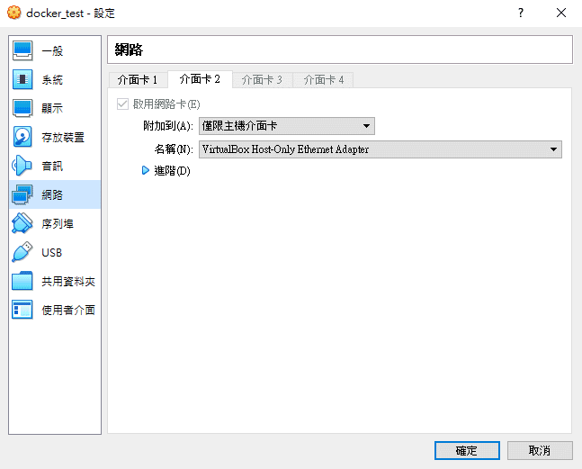

這篇文章紀錄以 Gitlab CI/CD 建構一條 .NET Core 專案 DevOps Pipeline 的過程，
所有動作都採取容器化的方案，因此需要在 Server 上先安裝容器軟體，
機器實體或虛擬機器不拘，這裡是使用 virtualbox 開一台 ubuntu 的虛擬機作為伺服器，
使用的環境為 Linux(Ubuntu 20.04 LTS)，因此需要熟悉一些 Linux 指令，
如果是從 Window 體系來的 Linux 都不熟，
那麼這篇文章的目標原本是讓你照打就能輕易建構一條 Pipeline，試試看我是否有成功吧！

# 設定虛擬機
 > 如果不需要自己用 virtualbox 見機器做測試的可以跳過這一節。  

首先你必須要安裝 virtualbox，然後安裝一部 Ubuntu 20.04 VM。  
因為 VM 必須滿足這兩項網路需求，因此必須額外設定虛擬機網路 ：
 1. 必須可以上網(要安裝東西)，透過預設的 virtualbox NAT 網路。
 2. 必須讓 Host 得以透過 IP 進行通訊，要透過 virtualbox 上的 Host-Only 網路卡。

NAT 網路是 virtualbox 在建立新的 VM 時默認的設置，因此不需要調整；
我們需要在機器添加使用 Host-Only Adaptor 網路的網卡：


外部添加完網路卡之後，必須要進入 VM 新建一個網卡 enp0s8，修改VM上的檔案 `/etc/netplan/00-installer-config.yaml`，具體來說長這樣：
```yaml
network:
  ethernets:
    enp0s3:
      dhcp4: true
    enp0s8:
      addresses: [192.168.56.100/24]  # 指定靜態IP、網段遮罩
      routes:
      dhcp4: no # 關閉 dhcp 自動取得 IP
      dhcp6: no # 關閉 dhcp 自動取得 IP
      - to: 192.168.56.1/24
        via: 192.168.56.1
        metric: 100
  version: 2
```
測試設定
```bash
sudo netplan try
  Warning: Stopping systemd-networkd.service, but it can still be activated by:
  systemd-networkd.socket
  Do you want to keep these settings?
  Press ENTER before the timeout to accept the new configuration
  Changes will revert in 120 seconds
  Configuration accepted.
```
應用網卡設定
```bash
sudo netplan apply
```

如此一來，在 host 就可以用 `192.168.56.100` 連接虛擬機器
同理，在虛擬機器可以透過 `192.168.56.1` 連接 host，


下一步是設置 Host 對應，把
在伺服器沒有 Domain 的情況(例如用虛擬機器)需要透過更改 Client 端的 host 設定檔讓 client 不必透過 DNS 就能將自定義的 Domain 對應到伺服器的 IP：
假設要對應的 domain 是 gitlab.example.com
window 下的做法：
Linux 環境下的作法：
# 安裝 Docker
指令
```bash
# 先解除安裝舊版本
sudo apt-get remove -y docker docker-engine docker.io containerd runc

# 安裝 docker 需要的套件
sudo apt-get update
sudo apt-get install -y \
    apt-transport-https \
    ca-certificates \
    curl \
    gnupg \
    lsb-release

# 添加 Docker GPG key
curl -fsSL https://download.docker.com/linux/ubuntu/gpg | sudo gpg --dearmor -o /usr/share/keyrings/docker-archive-keyring.gpg

# 把 docker 的 stable 版本加到套件來源清單中
echo \
  "deb [arch=amd64 signed-by=/usr/share/keyrings/docker-archive-keyring.gpg] https://download.docker.com/linux/ubuntu \
  $(lsb_release -cs) stable" | sudo tee /etc/apt/sources.list.d/docker.list > /dev/null
  
# 安裝 Docker Engine
sudo apt-get update
sudo apt-get install -y docker-ce docker-ce-cli containerd.io

# 用 test image 測試 docker 安裝是否成功
sudo docker run hello-world
```
由於 docker 只有 root 或 docker 群組能夠使用(/var/run/docker.sock 的權限)，故需要把當前使用者加到 docker 群組。
```bash
sudo usermod -aG docker ${USER}
```
安裝 docker-compose
```bash
sudo apt-get install -y docker-compose
```

# 安裝 Gitlab
## 處理http埠號
用 nginx 做反向代理消除 port number
## 處理ssh埠號 
自動導向 host git user 的 ssh 到 gitlab ssh port

# 建立專案 
這裡用一個後端的專案作為 demo
## 版控
## Dockerfile

# gitlab-runner
這裡架構兩條 pipeline：
自動化部屬(包含遠端部屬，用 ssh 指令?)
自動化原始碼品質偵測 sonarqube

# Reference
https://segmentfault.com/a/1190000040414390
https://askubuntu.com/questions/984445/netplan-configuration-on-ubuntu-17-04-virtual-machine